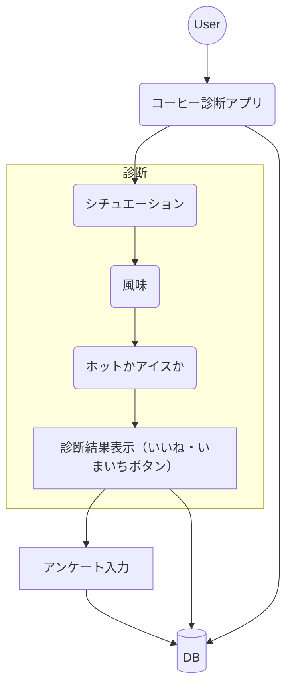
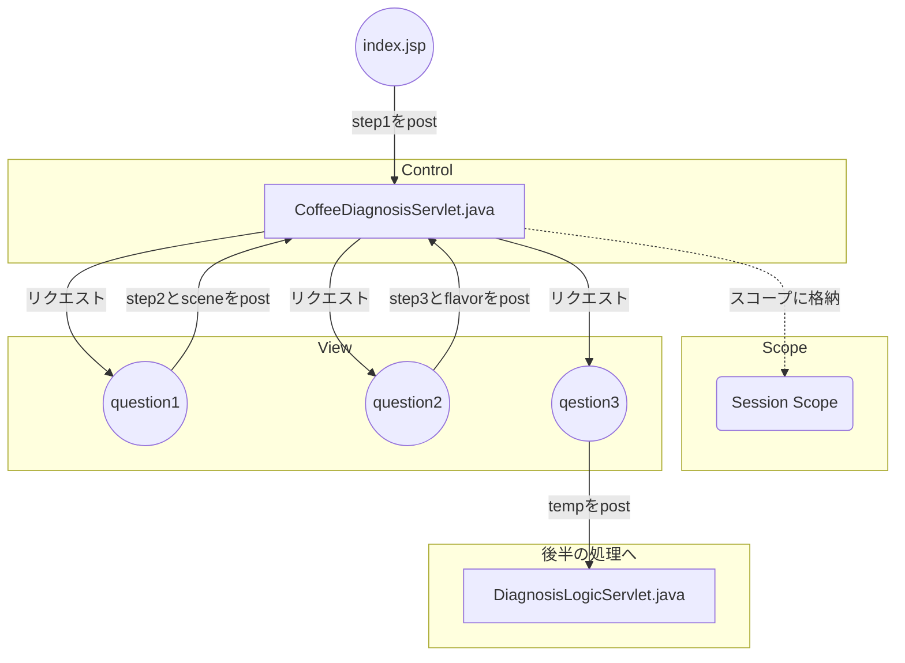
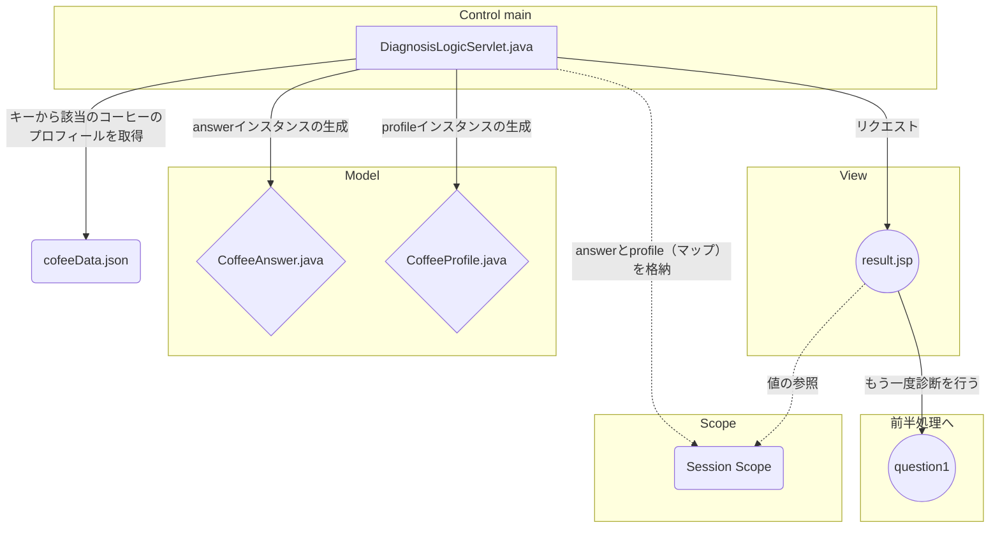
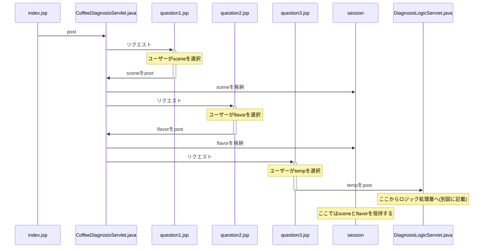
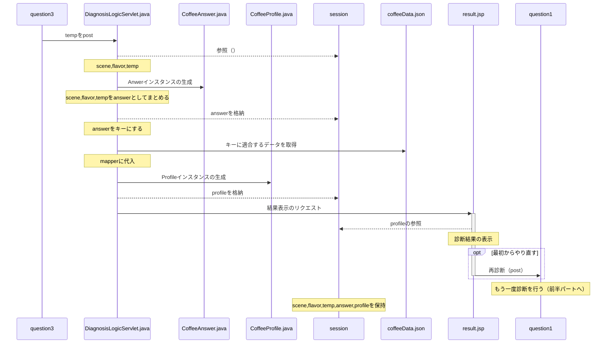

このアプリを起動する際は「index.jsp」からお願いします（/CoffeeDiagnosis/webapp/TOP_JSP/index.jsp）。

# コーヒー診断アプリ 要件定義書

## 1. アプリケーション概要
ユーザーが3つの質問に答えることで、好みに合ったコーヒーを提案する診断型Webアプリケーション。  
診断結果には産地・味の特徴などを含むコーヒーのプロフィールを表示します。

---

## 2. 完了済み要件（2025年5月現在）

### 2.1 診断フロー（3ステップ）
- **質問1**：コーヒーを飲むシチュエーション（朝 / 仕事中 / リラックスタイム）
- **質問2**：好みの風味（フルーティー / 甘み / ビター / ナッツ）
- **質問3**：温度（ホット / アイス）

➡ 組み合わせは 3 × 4 × 2 = **24通り**

### 2.2 診断ロジック
- 24パターンを**決め打ち方式**でJSONデータと紐づけ
- 各コーヒーの情報はJSONファイルで管理

### 2.3 表示内容（診断結果）

- プロフィール情報：
  - 産地、品種、焙煎度、栽培標高、プロセス
  - 味の特徴

### 2.4 技術スタック
- Java（Servlet, JSP）
- HTML / CSS
- JSONによるデータ管理（DB未使用）
- MVCモデルによる構成

### 2.5 基本機能
- 診断スタート画面（index.jsp）
- 各質問画面（question1.jsp ～ question3.jsp）
- 結果表示画面（result.jsp）
- 「診断をやり直す」ボタンの実装

---

## 3. 非要件定義（将来的な拡張候補）

| 分類 | 内容 | 説明 |
|------|------|------|
| 診断ロジック拡張 | 数値マッピング方式 | 各質問にスコアを設定し、総合値から類似度の高いコーヒーを提案する |
| データベース対応 | DBによる管理 | JSONからSQL/NoSQL DBに移行し、診断データやユーザー情報を永続化 |
| 機械学習連携 | 類似傾向分析 | ユーザーの診断履歴から傾向を学習し、提案精度を向上させる |
| UI/UX強化 | デザインの統一と改善 | テーマカラー、ボタンデザインの刷新、レスポンシブ対応 |
| アンケート導入 | ユーザー傾向の収集 | 診断後に年齢・性別・地域・利用傾向を任意入力できる |
| 検索機能追加 | 産地や風味別の検索 | 質問形式ではなく、条件検索でコーヒーを探せる |
| 焙煎度補正 | スコア補正機能 | 診断結果の味覚スコアに焙煎度の影響を加味するロジック導入 |

---

## 4. 使用想定
- 初学者向けのWebアプリケーション開発課題
- Java / JSP / Servlet / JSON の技術統合練習
- UX改善や推薦ロジック強化を視野に入れた段階的拡張が可能

# CoffeeDiagnosis
Coffee app

