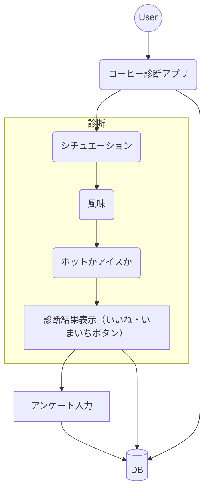

```mermaid
graph TD
User((User))
top(コーヒー診断アプリ)
A(シチュエーション)
B(風味)
C(ホットかアイスか)
result[診断結果表示（いいね・いまいちボタン）]
D[アンケート入力]
E[(DB)]


User --> top
top --> A
subgraph 診断 
A --> B
B --> C
C --> result
end

result --> D
D --> E

%% DBとの関係補助線
top --> E
result --> E


```