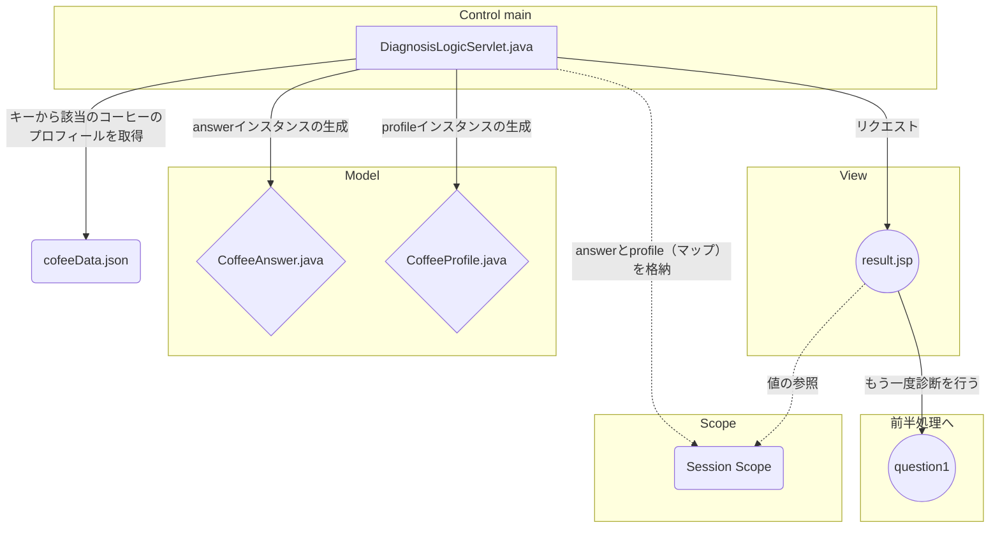

```mermaid
graph TD

subgraph Model
B{CoffeeAnswer.java}
C{CoffeeProfile.java}
end
subgraph Control main
A[DiagnosisLogicServlet.java]
end
subgraph Scope
Z(Session Scope)
end
subgraph View
D((result.jsp))
end
subgraph 前半処理へ
X((question1))
end
Y(cofeeData.json)

A -->|キーから該当のコーヒーのプロフィールを取得| Y
A -->|answerインスタンスの生成| B
A -->|profileインスタンスの生成| C
A .->|answerとprofile（マップ）を格納| Z


A -->|リクエスト| D
D .->|値の参照| Z
D -->|もう一度診断を行う| X
```