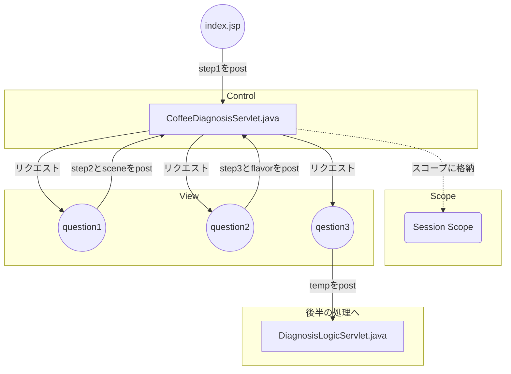

```mermaid
graph TD

top(("index.jsp"))

subgraph Control
A["CoffeeDiagnosisServlet.java"]
end
subgraph Scope
Z("Session Scope")
end
subgraph View
B(("question1"))
C(("question2"))
D(("qestion3"))
end
subgraph 後半の処理へ
X["DiagnosisLogicServlet.java"]
end
top -->|step1をpost| A
A -->|リクエスト| B
A -->|リクエスト| C
A -->|リクエスト| D
A .->|スコープに格納| Z
B -->|step2とsceneをpost| A
C -->|step3とflavorをpost| A

D -->|tempをpost| X

```