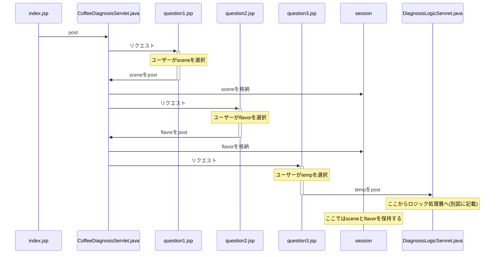

```mermaid
sequenceDiagram

participant a as index.jsp
participant b as CoffeeDiagnosisServlet.java
participant c as question1.jsp
participant d as question2.jsp
participant e as question3.jsp
participant f as session
participant g as DiagnosisLogicServret.java


a ->> b: post
b ->>+ c: リクエスト
Note over c: ユーザーがsceneを選択
c ->>- b: sceneをpost
b ->> f: sceneを格納
b ->>+ d: リクエスト
Note over d: ユーザーがflavorを選択
d ->>- b: flavorをpost
b ->> f: flavorを格納
b ->>+ e: リクエスト
Note over e: ユーザーがtempを選択
e ->>- g: tempをpost
Note over g: ここからロジック処理層へ(別図に記載)
Note over f: ここではsceneとflavorを保持する
```