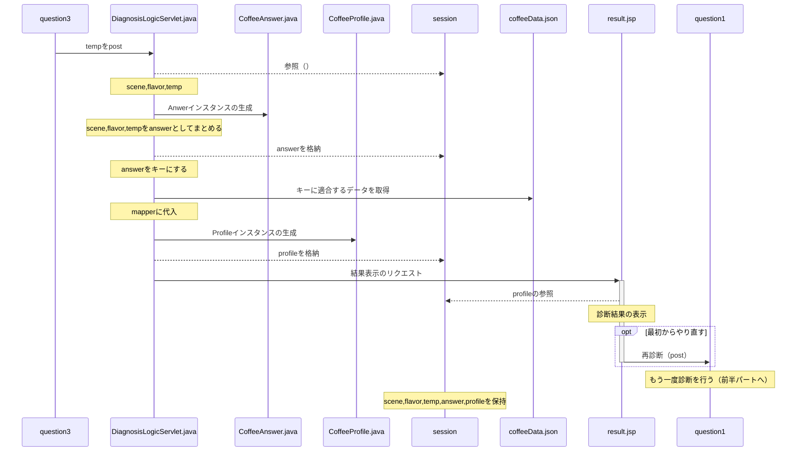

```mermaid
sequenceDiagram

participant e as question3
participant a as DiagnosisLogicServlet.java
participant b as CoffeeAnswer.java
participant c as CoffeeProfile.java

participant f as session
participant g as coffeeData.json
participant d as result.jsp
participant h as question1

e ->> a: tempをpost
a -->> f: 参照（）
Note over a: scene,flavor,temp
a ->> b: Anwerインスタンスの生成
Note over a: scene,flavor,tempをanswerとしてまとめる
a -->> f: answerを格納
Note over a: answerをキーにする
a ->> g: キーに適合するデータを取得
Note over a: mapperに代入
a ->> c: Profileインスタンスの生成
a -->> f: profileを格納
a ->>+ d: 結果表示のリクエスト
d -->> f: profileの参照
Note over d: 診断結果の表示
opt 最初からやり直す
    d ->>- h: 再診断（post）
end
Note over h: もう一度診断を行う（前半パートへ）
Note over f: scene,flavor,temp,answer,profileを保持
```